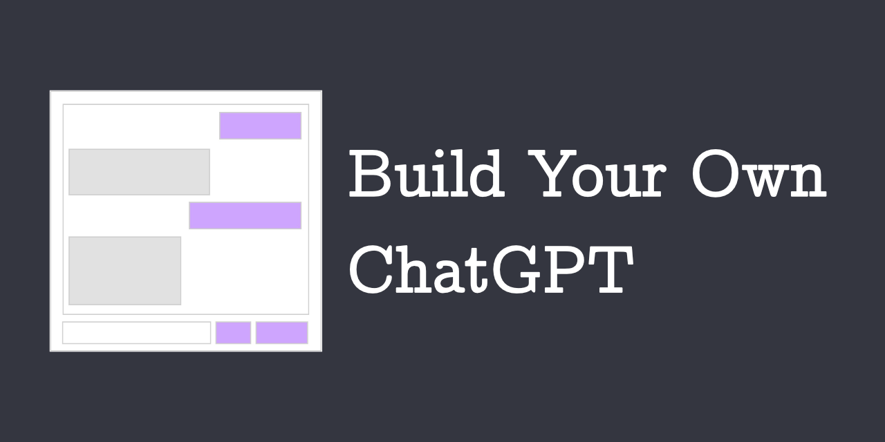

Welcome to the GPT-3 Chatbot! This is a small web app that queries the OpenAI
API to make a chatbot powered by GPT-3. The chatbot also has a persona, which
can be chosen on the home page.

A lot of this code (and basically all of the README!) was adapted from the
OpenAI [Quickstart Tutorial](https://github.com/openai/openai-quickstart-python)
for Python.

## Tutorial
[I](https://alyssahwang.com) worked on this project as part of my PhD candidacy exam
(WPE-II for fellow Penn CIS people). Check out my report (TBA) "Build Your Own ChatGPT" 
for more a practical overview of GPT-3, design critique, and code walkthrough. 

## A Slight Bug...
The chatbot supports querying any fine-tuned model that you have on your
account, but it supports only `text-davinci-002` out of the regular GPT-3
models because of the way the API is set up. Adding the rest is a simple fix
that I haven't gotten around to yet!

## Setup
1. If you don’t have Python installed, install it from here

2. Clone this repository

3. Navigate into the project directory

```
$ cd gpt3-chatbot
```

4. Create a new virtual environment

```
$ python -m venv venv
$ . venv/bin/activate
```

5. Install the requirements

```
$ pip install -r requirements.txt
```

6. Make a copy of the example environment variables file

```
$ cp .env.example .env
```

7. Add your [API key](https://beta.openai.com/account/api-keys) to the newly
created .env file

8. Run the app

```
$ flask run
```

You should now be able to access the app at http://localhost:5000!
